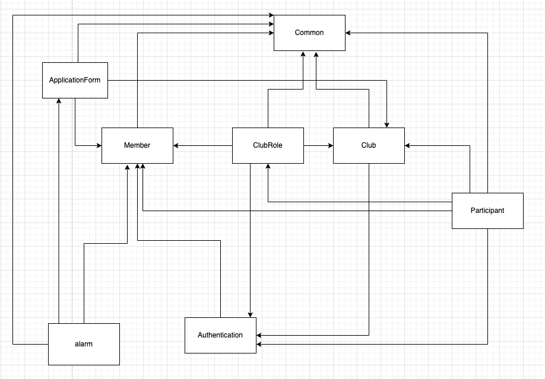
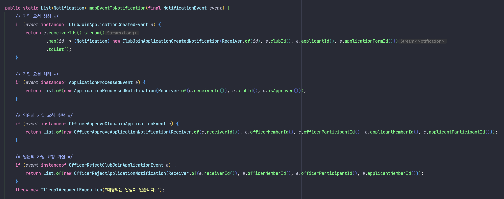
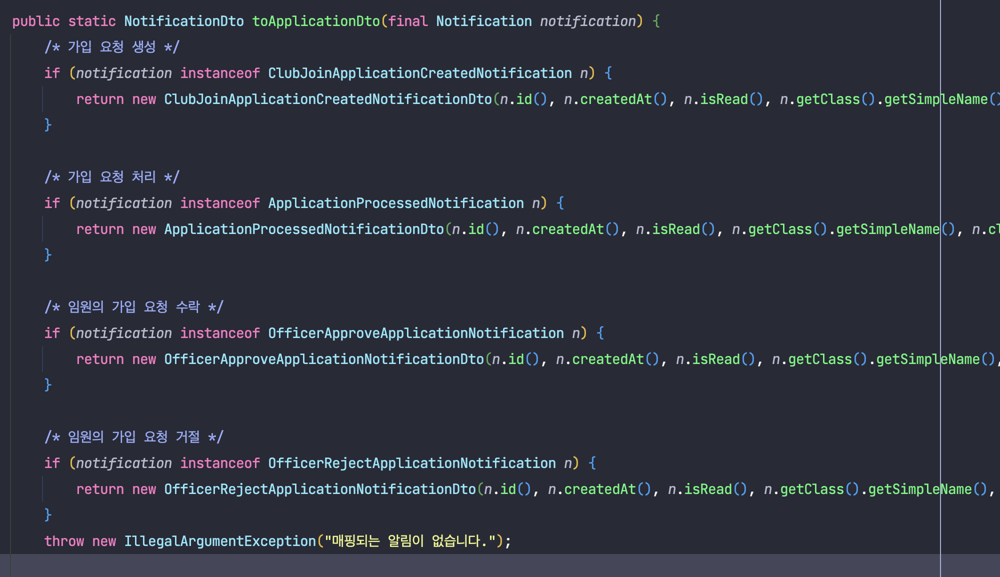
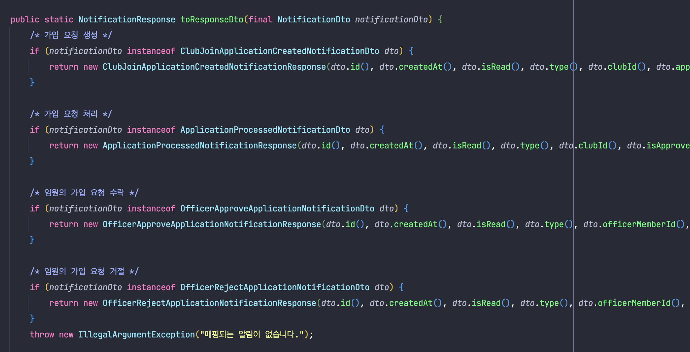

# 모임 관리 서비스

패키지 간 의존성




<br>
<br>
<br>

### @Async 적용 시

@Async를 통해 비동기 작업을 진행하면, 다른 쓰레드에서 일어남으로 같은 Transaction을 사용할 수 없어짐.

https://okky.kr/articles/1033767

https://newwisdom.tistory.com/m/127

https://kobumddaring.tistory.com/m/42

```
@Async 어노테이션의 매커니즘을 자세히 설명한 글이 없어 그냥 소스 코드를 분석하는 게 빠릅니다.
BeanPostProcessor와 프록시의 동작 방법을 이해하신다는 가정 하에 간단히 설명드리면
 AsyncAnnotationBeanPostProcessor가 @Async 메서드를 가진 빈을 처리하는데요,
 @Async 어노테이션을 가진 모든 로직은
 결론적으로 AsyncExecutionInterceptor#invoke 에서 실제 로직을 Callable 객체로 감싼 후,
 AsyncExecutionAspectSupport#doSumit 에서 Callable로 감싼 로직을 CompletableFuture로 감싼 후, 
 TaskExecutor에서 대신 실행하도록 넘겨주는 것을 확인할 수 있습니다.

여기서 현재 프록시가 실행되는 쓰레드와 우리가 작성한 실제 로직이 실행되는 쓰레드가 분리되는 것을 직접 확인하실 수 있습니다.```

```

<br>
<br>
<br>

## instanceOf 분리하기

`알림`은 여러 종류가 있습니다.

여러 종류의 `이벤트`를 통해 `알림`이 각각 생성되며, `알림`이 가지고 있어야 할 정보들이 각기 다른 상황이었습니다.

즉 여러 종류의 `이벤트` - 여러 종류의 `알림 Entity` 가 대응되는 상황이었으며
`Entity`별로 `DTO`와 `Response`가 다르게 존재하는 상황이었습니다.

처음에는 `알림`을 생성하는 `이벤트`를 추상 클래스로 정의하여 `Common` 패키지에 위치시켰습니다.

이후 각각의 도메인에서는 해당 `이벤트`를 상속받아 구현하였고, `EventHandler`를 정의하여 이벤트를 받으면 대응되는 `알림`을 생성하여 저장하도록 구현하였습니다.

이때 여러 종류의 `알림 엔티티`는 `Notification` 패키지에 위치하고 있었고, 다른 도메인에서는 `Notification`을 모르게 하기 위해 `Notifiaction` 패키지에서 `이벤트`에
대응되는 `알림`을  `instanceof`를 통해 다음과 같이 구분하여 변환하였습니다.


이때 `Entity`는 `DTO`를 모르도록 구현하고 싶었기에
(`DTO`는 `Application Layer`에 존재하므로
`domain` 계층의 `Entity`가 이를 알게된다면 `domain` -> `application`으로의 의존성이 생기기 때문입니다.),
`Entity` -> `DTO`를 변환하는 과정에서도 이와 같이 `instanceof`를 사용하였습니다.

마찬가지로 `DTO` 역시 `Presentation` 계층의 `Response`를 모르게 하고 싶었기에 `instanceof`를 통해 구현하였습니다.



그러나 `instanceof`의 를 샤용하는 것이 좋지 않다 판단하여, 다음과 같이 수정하였습니다.

1. 우선 `Event` -> `Entity` 매핑에서는 `전략 패턴`을 사용하여 구현하였습니다. 각 전략은 이벤트를 대응되는 알림으로 변환하는 코드만 작성하면 됩니다.
2. `instanceOf`보다는 `Entity`가 `DTO`를 알게 하는 편이 나을 것 같았습니다.(복잡도가 훨씬 낮으며, 또한 알림의 종류가 많아질 경우 훨씬 실수할 위험도 줄어들 것이라 생각하였습니다.)
   따라서 `Noticiation`이라는 추상 클래스에 `toDto()`라는 `추상 메서드`를 만들어 각 클래스별로 대응되는 DTO를 반환하게끔 구현합니다.
3. 마찬가지로 `Application Layer`의 `DTO` 에서 `Presentation Layer`의 `Response`로 변환하는 과정 역시 `DTO.toResponse()`라는 `추상 메서드`를 통해
   구현하였습니다.

위 과정을 통해 결국 `Notification`에서는 `Domain` -> `Application`으로의 의존성과, `Application` -> `Presentation`으로의 의존성이 생겼으나,
`instanceOf`를 사용할 때 보다 코드도 깔끔해 졌으며, 무엇보다 이후 새로운 알림의 종류가 추가되었을 때 이를 위한 코드의 변경이 불필요해지며, 실수할 위험성도 줄어들었음을 느끼고,
이러한 장점이 더 크다 생각해 변경된 구조를 선택하였습니다.


